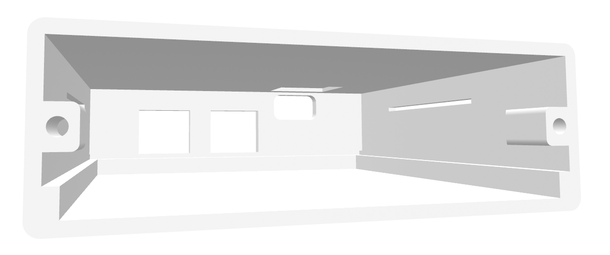
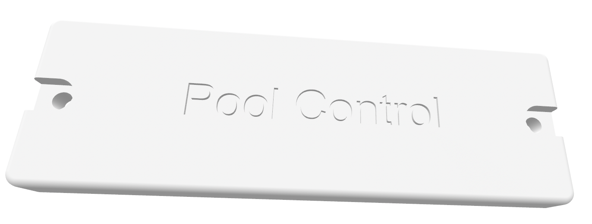

# Pool Controller Case
3d Models for pool controller case created with FreeCad.

This fits the [PCB from Pool Controller](https://github.com/marklynch/pool-controller-pcb)

## Images:

## Print Instructions:
This has been tested with a Bambu Lab A1 printer with a 0.4 nozzle.  

Import the two STL files into your project, choose your colour, and I've found the default settings work well.